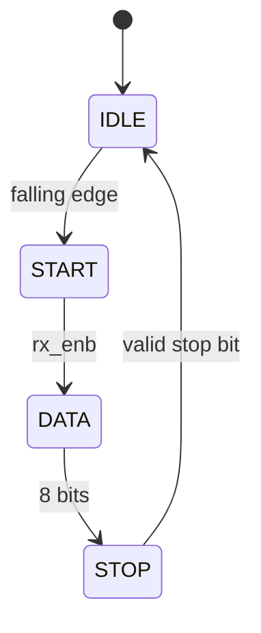

# UART (Universal Asynchronous Receiver + Transmitter) : A Tiny Tapeout Project

## How it works

This project implements a simple UART (Universal Asynchronous Receiver + Transmitter). It's capable of independently transmitting and receiving 8-bit serial data (8-N-1).  

| Field | Value |
|:---:|:---:|
| Data bits | 8 |
| Parity | None |
| Stop bits | 1 |

The design is split into four modules:

- **`tt_um_uart`** - the top-level wrapepr that maps pins to signals and instantiates the 3 following modules.

- **`baud_rate_gen`** - generates two enable ticks from the system clock. 'tx_counter' is free-running, wrapping around at 5208, producing 'tx_enb' (one pulse per baud period). 'rx_counter' wraps around at 326 (1/16th of 'tx_counter's range) This produces 'rx_enb' at 16x the rate to allow the receiver to oversample and locate the center of each incoming bit. 'rx_counter' resets every 'rx_sync' pulse (start-bit detection), keeping RX sampling aligned. 



- **`transmitter`** - FSM that on write request serializes an 8-bit byte onto the tx line as: start bit, 8 data bits (LSB first),  then a stop bit. 

- **`receiver`** - FSM that watches the rx line for a falling edge (start bit) then samples 8 data bits at the center od each bit period (16x oversampling to find bit-center), then checks for the stop bit and pulses rx_valid for one cycle with the received byte on rx_data.

**TX (transmit)**
| Signal | Pin | Direction |
|---|---|---|
| `tx_data` | `ui_in[7:0]` | input |
| `wr_enb` | `uio_in[0]` | input |
| `tx` | `uo_out[0]` | output |

**RX (receive)**
| Signal | Pin | Direction |
|---|---|---|
| `rx` | `uio_in[1]` | input |
| `rx_valid` | `uo_out[1]` | output |
| `rx_data[1:0]` | `uo_out[3:2]` | output |
| `rx_data[7:2]` | `uio_out[7:2]` | output |

**Note:** keep in mind that `rx_data` is split across two separate output buses

**Unused / fixed**
| Signal | Pin | Value |
|---|---|---|
| — | `uio_in[7:2]` | unused |
| — | `uo_out[7:4]` | tied to 0 |
| — | `uio_out[1:0]` | tied to 0 |
| `uio_oe` | — | fixed `8'b1111_1100` |

**Note:** `uio_oe` is fixed since I needed to accommodate 6 continuous
output pins for the upper bits of rx_data and 2 input pins for wr_enb
and rx.

### Limitations
- No parity bit. 
- If there is a bad frame, it is simply never latched with no downstream indication the error occurred. 
- `rx_data` is split between two buses:  `uio_out` and `uo_out`


## How to test

**RTL simulation**

```bash
cd test
pip install -r requirements.txt
make -B
```

**GLS**

Requires one-time PDK setup which can be a headache ;-;. 


## External hardware

None required, however, I will be connecting it to a microcontroller for validation. 